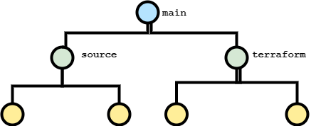

# Jenkins
- [Integrate Jenkins with AWS CodeBuild and CodeDeploy](https://aws.amazon.com/blogs/devops/setting-up-a-ci-cd-pipeline-by-integrating-jenkins-with-aws-codebuild-and-aws-codedeploy/)
- [Install Instructions](https://www.jenkins.io/doc/book/installing/linux/)
- [Jenkinsfile](https://www.jenkins.io/doc/book/pipeline/jenkinsfile/)

## Super General Picture of Repo Workflow

- Goal is to have all final source code push to source branch and all final Terraform code pushed to terraform branch. Using these two branches, Jenkins will have a separate set of tasks to run and deploy.

## Current Jenkins Setup
### EC2 Instance
- ec2 instance w/ Jenkins installed: djr-jenkins-test-main
  - accessible via SSM using djr-jenkins-role IAM Role
- jenkins ui accessible via link sent in group chat

### IAM Role
- name: djr-jenkins-role
- current policies
  - SSMFullAccess

### Security Group
- name: djr-jenkins-sg
- inbound allowed for:
  - ssh using cmoor-pem
  - ssm
  - 80
  - 443
  - 8080
- outbound currently default all

### Useful Jenkins Docs
- [Multibranch Pipeline](https://www.jenkins.io/doc/pipeline/steps/workflow-multibranch/)
- [Multibranch Scan Webhook Trigger Plugin](https://plugins.jenkins.io/multibranch-scan-webhook-trigger/)
  - Requires Webhook for repo: JENKINS_URL/multibranch-webhook-trigger/invoke?token=[Trigger token]
    - **Already setup so Jenkins will automatically be triggered by a push to the repo**
    - Still need to filter by branch to reduce traffic to the ec2 node

